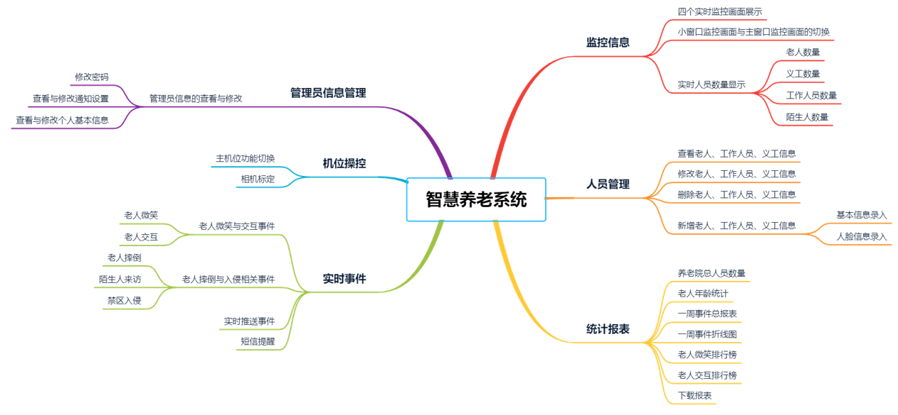
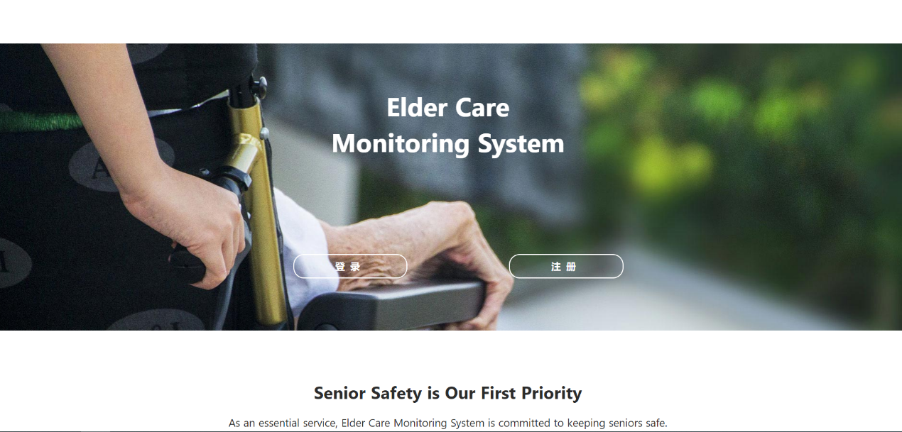
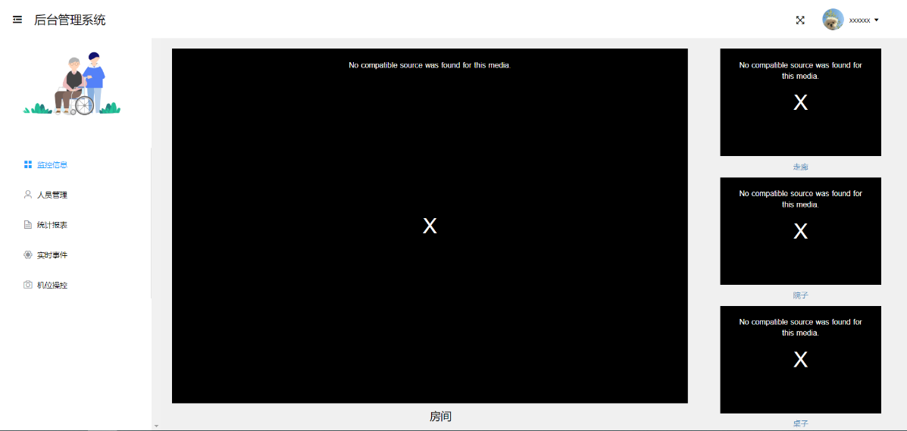
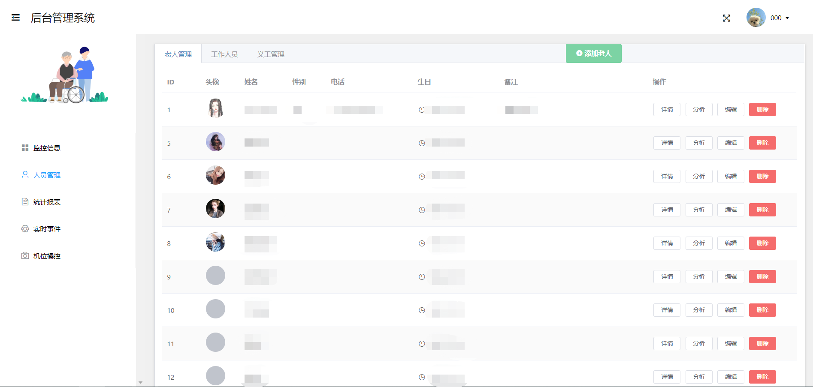
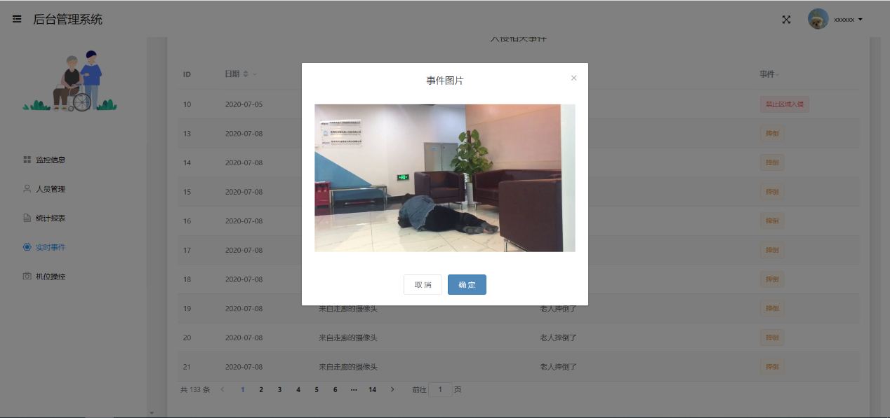

##  基于情感分析的智慧养老系统

### Introduction

基于情感分析的智慧养老系统通过计算机视觉、机器学习与商业智能技术为老年人提供健康保障。本项目通过模拟多视角的相机捕捉系统视野内的老人活动，将数据实时传输到数据库，通知Web页面更新显示。

智慧养老系统的主要功能如下图所示，包含用户查看监控信息、人员管理、生成统计报表、查看实时事件、机位操控和管理员信息管理六个主要功能。

项目包含很多前端的功能：vue框架、nuxt路由、axios封装、echart统计报表、rtmp视频解码、头像上传、完整的信息提示、websocket实时刷新、cookie、组件复用、父子组件相互调用

以下为主要页面展示

#### 初始页面

#### 主页面

#### 人员管理页面

#### 事件页面

### Installation

1.  安装git
2.  node.js
3.  百度一下vue 的安装过程
4.  使用webstorm git clone 该项目
5.  使用命令行运行 npm run dev

### Contribution

1.创建自己的分支
2.每次拉之前先pull其他人的分支
3.push到自己的分支上
4.由我统一合并

### Repositories

本仓库为前端仓库

后端仓库 <https://github.com/Shzhuoyu/cv_backend>

监控端仓库 <https://github.com/Tang1705/CVofSSE>

